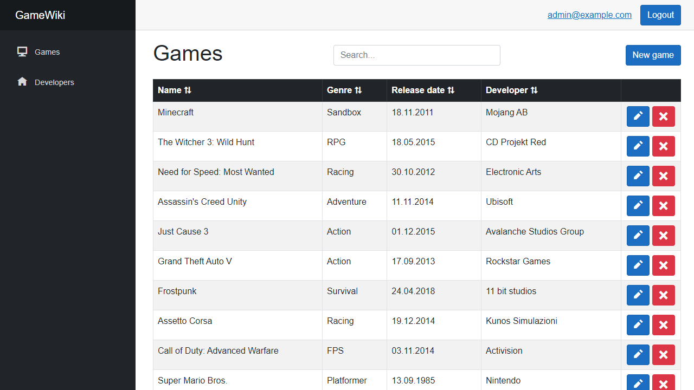

# GameWiki

An ASP.NET Core Blazor app for browsing games and developers written in C#



## Requirements

- [.NET Core SDK](https://www.microsoft.com/net/core) (tested on 7.0.401)
- [.NET Core CLI](https://learn.microsoft.com/en-us/ef/core/cli/dotnet) (tested on 7.0.14)
- [SQL Server Express LocalDB](https://learn.microsoft.com/en-us/sql/database-engine/configure-windows/sql-server-express-localdb) (tested on 15.0.4153)

## Installation

**All commands must be executed in the project's root directory**

Verify that you have .NET Core SDK and .NET Core CLI installed on your system:

```bash
  dotnet --version
  dotnet ef
```

Apply the migrations to the database:

```bash
  dotnet ef database update
```

After updating the database, you can run the application by executing:

```bash
  dotnet run
```

Now, you can open the browser using http://localhost:5268 or https://localhost:7052
